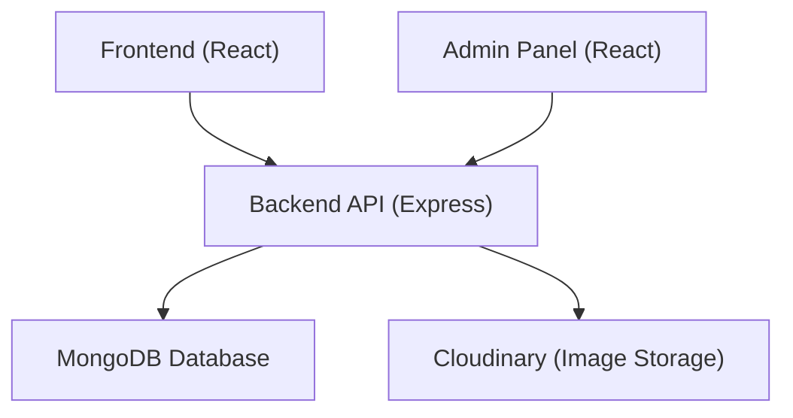

# FashionHub - E-commerce Platform

## Table of Contents
- [Overview](#overview)
- [Architecture](#architecture)
- [Features](#features)
- [Technology Stack](#technology-stack)
- [Prerequisites](#prerequisites)
- [Installation & Setup](#installation--setup)
- [Environment Configuration](#environment-configuration)
- [Running the Application](#running-the-application)
- [API Documentation](#api-documentation)
- [Deployment](#deployment)
- [Project Structure](#project-structure)
- [Contributing](#contributing)

## Overview

FashionHub is a full-stack e-commerce platform designed for fashion retail, featuring a customer-facing frontend, an administrative dashboard, and a robust backend API. The platform supports product management, user authentication, shopping cart functionality, and order processing.

## Architecture

The project follows a three-tier architecture:

- **Frontend**: Customer-facing React application [1](#3-0) 
- **Admin Panel**: Administrative React dashboard [2](#3-1) 
- **Backend**: Node.js/Express REST API server [3](#3-2) 



## Features

### Customer Features
- User registration and authentication [4](#3-3) 
- Product browsing and search [5](#3-4) 
- Shopping cart management [6](#3-5) 
- Order placement and tracking [7](#3-6) 
- Product collection filtering [8](#3-7) 
- Order verification system [9](#3-8) 

### Admin Features
- Product management (Add/Edit/Delete) [10](#3-9) 
- Order management and tracking [11](#3-10) 
- Admin authentication [12](#3-11) 

## Technology Stack

### Frontend
- **Framework**: React 19.1.0 [13](#3-12) 
- **Build Tool**: Vite 6.3.5 [14](#3-13) 
- **Styling**: TailwindCSS 4.1.7 [15](#3-14) 
- **Routing**: React Router DOM 7.6.1 [16](#3-15) 
- **HTTP Client**: Axios 1.11.0 [17](#3-16) 
- **Notifications**: React Toastify 11.0.5 [18](#3-17) 

### Backend
- **Runtime**: Node.js with Express.js [19](#3-18) 
- **Database**: MongoDB with Mongoose ODM [20](#3-19) 
- **Cloud Storage**: Cloudinary for image management [21](#3-20) 
- **Authentication**: JWT-based authentication
- **CORS**: Cross-origin resource sharing enabled [22](#3-21) 

### Admin Panel
- **Framework**: React 19.1.1 [23](#3-22) 
- **Styling**: TailwindCSS 3.4.17 [24](#3-23) 
- **Build Tool**: Vite 7.1.2 [25](#3-24) 

## Prerequisites

- Node.js (v16 or higher)
- MongoDB (local installation or MongoDB Atlas)
- Cloudinary account for image storage
- npm or yarn package manager

## Installation & Setup

### 1. Clone the Repository
```bash
git clone https://github.com/Mohd-Ashraf-Malik/FashionHub.git
cd FashionHub
```

### 2. Backend Setup
```bash
cd backend
npm install
```

### 3. Frontend Setup
```bash
cd ../frontend
npm install
```

### 4. Admin Panel Setup
```bash
cd ../admin
npm install
```

## Environment Configuration

Create a `.env` file in the backend directory with the following variables:

```env
# Database Configuration
MONGODB_URI=your_mongodb_connection_string

# Cloudinary Configuration
CLOUDINARY_NAME=your_cloudinary_name
CLOUDINARY_API_KEY=your_cloudinary_api_key
CLOUDINARY_SECRET_KEY=your_cloudinary_secret_key

# Server Configuration
PORT=4000

# JWT Configuration
JWT_SECRET=your_jwt_secret_key
```

Create a `.env` file in the admin directory:

```env
VITE_BACKEND_URL=http://localhost:4000
```

## Running the Application

### Development Mode

1. **Start the Backend Server**:
   ```bash
   cd backend
   npm start
   ```
   Server runs on port 4000 [26](#3-25) 

2. **Start the Frontend**:
   ```bash
   cd frontend
   npm run dev
   ```
   Access at: `http://localhost:5173` [27](#3-26) 

3. **Start the Admin Panel**:
   ```bash
   cd admin
   npm run dev
   ```
   Access at: `http://localhost:5174` [28](#3-27) 

### Production Build

1. **Build Frontend**:
   ```bash
   cd frontend
   npm run build
   ```

2. **Build Admin Panel**:
   ```bash
   cd admin
   npm run build
   ```

## API Documentation

### Base URL
```
http://localhost:4000/api
```

### User Routes [29](#3-28) 
- `POST /api/user/register` - User registration [30](#3-29) 
- `POST /api/user/login` - User login [31](#3-30) 
- `POST /api/user/admin` - Admin login [32](#3-31) 

### Product Routes [33](#3-32) 
- Product CRUD operations and management

### Cart Routes [34](#3-33) 
- Shopping cart management functionality

### Order Routes [35](#3-34) 
- Order processing and management

## Deployment

### Backend Deployment
1. Set up environment variables on your hosting platform
2. Ensure MongoDB connection is configured for production
3. Deploy to platforms like Heroku, Railway, or DigitalOcean

### Frontend Deployment
1. Update API endpoints in production builds
2. Deploy to platforms like Netlify, Vercel, or traditional hosting

### Database Deployment
- Use MongoDB Atlas for cloud database hosting
- Configure connection string in production environment

## Project Structure

```
FashionHub/
├── backend/
│   ├── config/          # Database and service configurations
│   ├── controllers/     # Route controllers
│   ├── middleware/      # Custom middleware
│   ├── models/          # Database models
│   ├── routes/          # API routes
│   └── server.js        # Main server file
├── frontend/
│   ├── src/
│   │   ├── assets/      # Static assets
│   │   ├── components/  # Reusable React components
│   │   ├── context/     # React context providers
│   │   ├── pages/       # Page components
│   │   ├── App.jsx      # Main App component
│   │   └── main.jsx     # Application entry point
│   ├── index.html       # HTML template
│   └── package.json     # Dependencies and scripts
└── admin/
    ├── src/
    │   ├── assets/      # Static assets
    │   ├── components/  # Admin components
    │   ├── pages/       # Admin pages
    │   ├── App.jsx      # Admin App component
    │   └── main.jsx     # Admin entry point
    └── package.json     # Admin dependencies and scripts
```

## Data Models

### Product Schema [36](#3-35) 
- Name, description, price
- Multiple images support
- Categories and subcategories
- Size variations
- Bestseller flag

## Notes

- The platform uses separate React applications for customer and admin interfaces, allowing for independent deployment and scaling
- MongoDB is used for data persistence with Mongoose ODM for schema management
- Cloudinary integration provides robust image storage and processing capabilities
- The backend follows RESTful API design principles with modular route organization
- Both frontend applications use modern React features and Vite for optimal development experience
- TailwindCSS is used for responsive, utility-first styling across both client applications

This README provides comprehensive setup and deployment guidance based on the actual codebase structure and dependencies found in the FashionHub project.

### Citations

**File:** frontend/package.json (L7-7)
```json
    "dev": "vite",
```

**File:** frontend/package.json (L12-19)
```json
  "dependencies": {
    "@tailwindcss/vite": "^4.1.7",
    "axios": "^1.11.0",
    "react": "^19.1.0",
    "react-dom": "^19.1.0",
    "react-router-dom": "^7.6.1",
    "react-toastify": "^11.0.5",
    "tailwindcss": "^4.1.7"
```

**File:** frontend/package.json (L30-30)
```json
    "vite": "^6.3.5"
```

**File:** admin/package.json (L7-7)
```json
    "dev": "vite",
```

**File:** admin/package.json (L12-17)
```json
  "dependencies": {
    "axios": "^1.11.0",
    "react": "^19.1.1",
    "react-dom": "^19.1.1",
    "react-router-dom": "^7.8.1",
    "react-toastify": "^11.0.5"
```

**File:** admin/package.json (L30-30)
```json
    "tailwindcss": "^3.4.17",
```

**File:** admin/package.json (L31-31)
```json
    "vite": "^7.1.2"
```

**File:** backend/server.js (L1-33)
```javascript
import express from 'express'
import cors from 'cors'
import 'dotenv/config'
import connectDB from './config/mongodb.js';
import connectCloudinary from './config/cloudinary.js';
import userRouter from './routes/userRoutes.js';
import productRouter from './routes/productRoutes.js';
import cartRouter from './routes/cartRoute.js';
import orderRouter from './routes/orderRoute.js';

// App Config
const app = express();
const port = process.env.PORT || 4000;
connectDB();
connectCloudinary();

// middlewares
app.use(express.json());
app.use(cors());

// api end points
app.use('/api/user',userRouter);
app.use('/api/product',productRouter);
app.use('/api/cart',cartRouter);
app.use('/api/order',orderRouter);

app.get('/',(req,res)=>{
    res.send("API WORKING");
})

app.listen(port,()=>{
    console.log('Server started on PORT: '+port);
})
```

**File:** frontend/src/App.jsx (L14-14)
```javascript
import SearchBar from './components/SearchBar'
```

**File:** frontend/src/App.jsx (L26-26)
```javascript
        <Route path='/collection' element={<Collection/>} />
```

**File:** frontend/src/App.jsx (L30-30)
```javascript
        <Route path='/cart' element={<Cart/>} />
```

**File:** frontend/src/App.jsx (L31-31)
```javascript
        <Route path='/login' element={<Login/>} />
```

**File:** frontend/src/App.jsx (L32-33)
```javascript
        <Route path='/place-order' element={<PlaceOrder/>} />
        <Route path='/orders' element={<Orders/>} />
```

**File:** frontend/src/App.jsx (L34-34)
```javascript
        <Route path='/verify' element={<Verify/>} />
```

**File:** admin/src/App.jsx (L24-25)
```javascript
      {token === "" ? (
        <Login setToken={setToken} />
```

**File:** admin/src/App.jsx (L34-35)
```javascript
                <Route path="/add" element={<Add token={token}/>} />
                <Route path="/list" element={<List token={token}/>} />
```

**File:** admin/src/App.jsx (L36-36)
```javascript
                <Route path="/orders" element={<Orders token={token}/>} />
```

**File:** backend/config/mongodb.js (L1-1)
```javascript
import mongoose from "mongoose";
```

**File:** backend/config/cloudinary.js (L1-1)
```javascript
import {v2 as cloudinary} from "cloudinary"
```

**File:** backend/routes/userRoutes.js (L6-6)
```javascript
userRouter.post('/register',registerUser);
```

**File:** backend/routes/userRoutes.js (L7-7)
```javascript
userRouter.post('/login',loginUser);
```

**File:** backend/routes/userRoutes.js (L8-8)
```javascript
userRouter.post('/admin',adminLogin)
```

**File:** backend/models/productModel.js (L3-13)
```javascript
const productSchema = new mongoose.Schema({
    name: {type: String,required:true},
    description: {type: String,required:true},
    price: {type: Number, required:true},
    image: {type: Array,required:true},
    category: {type:String, required:true},
    subCategory: {type:String, required:true},
    sizes: {type: Array, required:true},
    bestseller: {type:Boolean},
    date: {type:Number,required:true}
})
```
